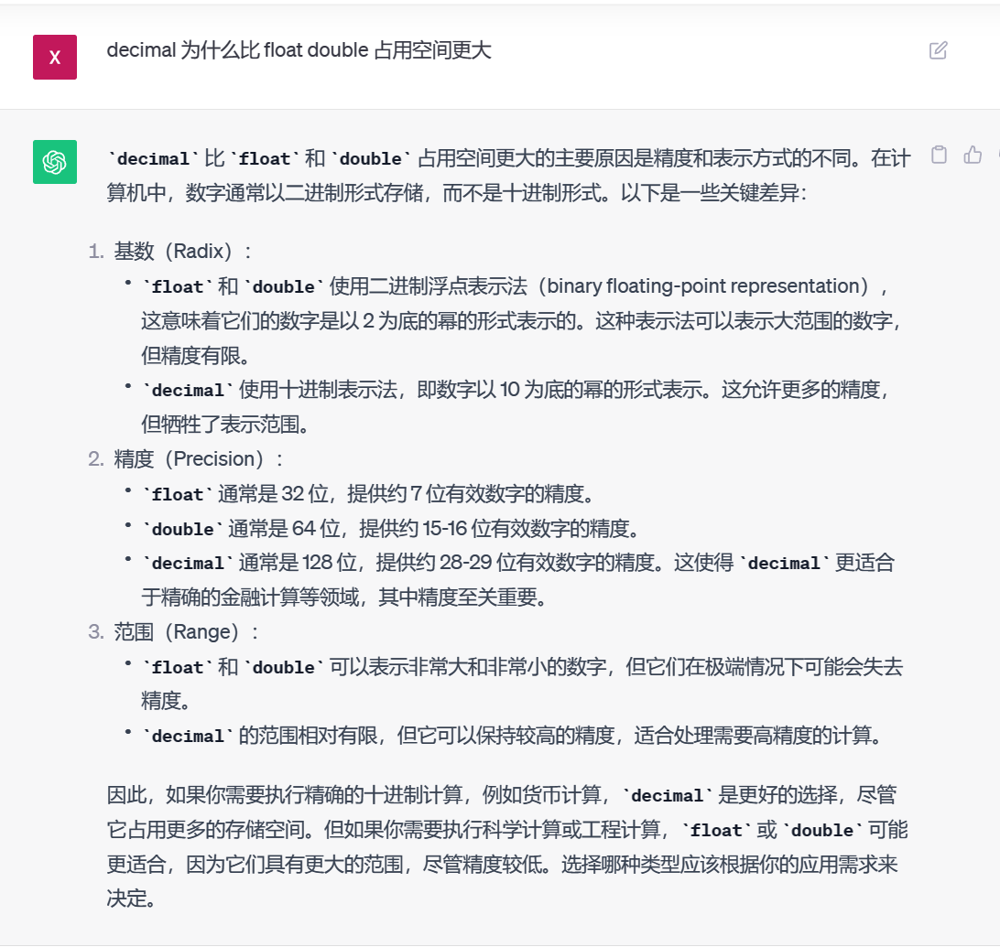

# 第四章 Schema 与数据类型优化

# 4.1 选择优化的数据类型

简单的法则：

- 更小的通常更好

最小的数据类型通常更快，因为占用的磁盘更少，内存和 CPU 缓存更少。

- 简单就好

简单的数据类型操作通常需要更少的 CPU 周期，整形比字符串代价更低

- 使用 MySQL 内建的类型而不是字符串存储日期和时间
- 应该使用整形存储 IP 地址；
- 尽量避免 NULL

查询列中有 null 值的话，优化更难，因为 null 值的列使得索引，索引统计，和值都比较复杂，可以为 null 的列需要更多的空间进行存储。当可以为 Null 的列被索引的时候，每个索引记录需要一个额外的字节，在 myisam 里甚至可能导致固定大小的索引变成可变大小的索引。

虽然索引调优修改 null 性能提升较小，但是应该在设计的时候就避免设计成可谓 null 的列。

innodb 使用单位的 bit 存储 Null 值，这对于稀疏数据有很好的空间效率。

> datetime 和 timesamp

timestamp 只使用了 datetime 一半的存储空间。并且根据时区，自动更新。

## 4.1.1 整形类型

whole number **vs** real number

类型：

- tinyint 8
- smallint 16
- mediumint 24
- int 32
- bigint 64

整数类型可以使用 unsigned 属性，表示不允许负值，可以使得正数的上线提高一倍。

对于 int(11) 这种指定宽度而言，大多数没有意义，他只是展示了值的合法范围。

## 4.1.2 实数类型

实数是带有小数部分的数字，既可以存储小数，也可以存储比 bigint 更大的值，mysql 服务器直接用自身实现了 decimal 的高精度计算，cpu 支持原生浮点运算，所以一般而言，double 和 float 的计算要高于 decimal。

decimal(18,9) -> 小数点两边各存储 9 个数字；而计算过程中，decimal 会转换为 double 类型；

**一律建议，只指定数据类型，不指定精度；**

浮点类型在存储同样范围的值的时候，通常比 decimal 使用更少的空间，float 使用 4 个字节存储，double 占用 8 个字节，相比于 float 有更高的精度和更大的范围。MySQL 使用 double 最为内部浮点计算的类型；

因为 decimal 需要额外的空间和计算开销，所以我们一般使用 bigint 代替 decimal ，如果含有小数，就乘以足够大的系数，这样比较省空间。这样可以避免精度不精确和 decimal 精度计算代价高的问题。



## 4.1.3 字符串类型

### varchar

- varchar 浮动长度

varchar 存储可变长度字符串，他比定长类型更省空间，因为它仅使用必要的空间，但是当 mysql 表使用了 ROW_FORMAT=FIXED 创建的话。每一行都会使用定长存储，但是这样很浪费空间。

当最大长度小于 255 个字节的时候，使用 1 个额外的字节作为长度，如果大于 255 个字节的时候，使用 2 个字节作为长度。varchar(10) 就需要 11 个字节的存储空间，varchar(1000) 需要 2 个字节存储长度信息。

- varchar 的分裂问题；

但是有个问题，varchar 长度是不固定的，所以如果一个行占用空间增长倒是页分裂的情况，myisam 会拆成不同的片段存储，innodb 需要分裂页使得行可以放入页内。

- 适用情况：
  - 字符串最大长度比平均长度大很多；
  - 列的更新很少
  - 使用了 UTF-8 的复杂的字符集，每个字符都使用不同的字节数进行存储；
- MySQL 在存储和检索的时候会保留末尾空格；
- InnoDB 会把过长的 varchar 存储为 blob

### char

- char 定长

char 类型是定长的，mysql 总是根据定义的字符串长度来分配足够的空间，当存储 char 值的时候，会删除末尾的空格。

- char 类型适合很短的字符串。或者所有值都是接近同一个长度。比如 md5 值可以使用 char 存储。因为 char 类型长度确定，不容易产生碎片。对于非常短的列，char 比 varchar 在存储空间更有效率。

对于 char 而言，不需要一个字节去记录长度，所以对于 y/n 的这种方式，使用 char(1) 记录明显比 varchar(1) 更有效率


- binary 和 varbinary 存储的是二进制字符串。二进制自字符串存储的字节码而不是字符，填充式\\0 的方式填充的，而不是空格，检索的时候也不会去掉填充值；

**但是二进制比字符串要快。**


### blob 和 text 类型

blob 和 text 都是为存储很大的数据而设计的字符串数据类型，分别采用二进制和字符方式进行存储。

- blob : 当值太大的时候，会用行内使用一个指针，指针指向的存储区域存储的值；
  - tinyblob
  - smallblob
  - blob
  - mediumblob
  - longblob
- text：当值太大的时候，会用行内使用一个指针，指针指向的存储区域存储的值；
  - tinytext
  - smalltext
  - text
  - mediumtext
  - longtext

blob 和 text 列进行排序是与其他类型不一样的，他支队每个列的最前 max_sort_length 字节进行排序，而不是对真个字符串进行排序。如果只需要按照一部分排序，可以缩短 max_sort_length 配置，或者说使用 order by substring(column,length);

- index

索引问题不能使用全部的字符串进行索引，也不能使用这些索引消除排序；

- 磁盘临时表和文件排序

因为 Memory 引起不支持 blob 和 text 类型，如果使用 blob 和 text 列并且需要使用隐式表，将不得不使用 myisam 磁盘临时表，即使只有几行数据也是如此。这样会导致严重的开销，即使配置 MySQL 将临时表存储在内存设备中，需要很昂贵的系统调用。

尽量避免使用 blob 和 text 类型，如果必须要使用，则使用 substring(column,length) 将需要用到这个列的转换为 varchar ，这样就可以使用内存临时表了。但是要确保截取的字符串足够短。不会好过临时表的大小超过 max_heap_table_size / tmp_table_size 的大小。当超过的时候会将内存临时表转换为 myIsam 磁盘临时表。

当 explain 执行计划，extra 列包含 using temporary 的时候，说明这个查询使用了隐式临时表；

### 使用 enum 代替字符串类型

枚举作为预定义集合会非常紧凑，会把列表值的数量压缩到一个或者两个字节中；

```sql
CREATE TABLE enum_test(e enum('fish','apple','dog') not null);

INSERT INTO enum_test(e) VALUES ('fish'),('dog'),('apple');

SELECT * from enum_test;
# enum 里面实际上存的是数字，而且这个数据内部是按照定义的时候的顺序进行排序的，而不是按照字母排序的，'fish','apple','dog' 按照这种方式；
SELECT e + 0 from enum_test;
```


但是这种排序没办法按照指定的方式进行排序，可以使用 field 函数显式的指定排序顺序；

```sql
SELECT e FROM enum_test e ORDER BY FIELD(e,'apple','dog','fish');
```

- 劣势：
  枚举不能从中间插入值，除非允许从数据末尾添加数值的方式；
- 开销

枚举查找的时候需要转换为字符串，转换的时候会带来一部分开销，但是当和 char、varchar 列关联的时候，可能会开销更大。


- 优势：
  - 把 data_length 中较大的值改成 enum 可以将表的大小缩小 1/3 某些情况下，即使出现了 enum / vahrchar 关联的情况也是值得的；

### 日期和时间类型

MySQL 能存储最小粒度是秒，当然可以存储微妙；

- DATETIME
  默认使用 yyyymmddhhmmss 的整数放置时间，使用 8 个字节存储空间；
- TIMESTAMP
  - 使用 4 个字节的存储空间，范围比 datetime 小很多，1970<x<2038， 使用 from_unixtime 将 linux 时间戳转换为时间，也可以通过 Unix_timestamp 将日期转换为时间戳；

```sql
SELECT FROM_UNIXTIME(1604511600);
```

- 如果插入没有指定第一个 timestamp 的值，MySQL 设置当前时间为这个列的值，插入一行记录的时候，MySQL 也会更新第一个 timestamp 列的值。

通常使用 timestamp，因为他比 datetime 空间效率高。

如何存储 bigint 类型存储微妙级别的时间戳呢？**就可以使用 bigint 存储微妙级别的时间戳，或者使用 double 存储秒之后的部分；**

两种方式：

1. 使用 bigint 存储所有的值。

```sql
CREATE TABLE your_table (
  your_microseconds BIGINT
);
```

2. 使用 datetime 存储到秒，然后使用 int 存储微妙级别后的数据。

```sql
CREATE TABLE your_table (
  your_datetime DATETIME,
  your_microseconds INT
);

```

## 4.1.5 位数据类型

#### BIT

可以在 bit 列存储一个或者多个 true/false 值，bit 最大长度是 64，myisam 可以使用 3 个字节存储 17 个 bit 位，但是类似于 Memory 或者 InnoDB 而言，每个 bit 列使用一个足够存储的最小整数来存放。所以不能节省存储空间。

bit 当做字符串类型，而不是数字类型，当检索 bit(1)的时候，结果是包含二进制的 0 1 的字符串，而不是 ascii 码的 0 、1 做全文检索的时候，是将位字符串转换为数字。


作为 bit 存储 true/false 值，或者可以设置一个 char(0) 列，可以保存空值或者长度为 0 的字符串

```sql
CREATE TABLE your_table (
  empty_string CHAR(0)
);

INSERT INTO your_table (empty_string) VALUES (''); -- 插入空字符串
INSERT INTO your_table (empty_string) VALUES (NULL); -- 插入空值

SELECT * FROM your_table;
```

#### SET

set 数据类型是 MySQL 存储一组字符串值，这些字符串可以从预定义的选项中进行选择，每个 set 列的值都是一组现象的字节，每个选项都有一个唯一的编号；

```sql
CREATE TABLE set_test(
  user_id INT PRIMARY KEY,
  color_preferences SET('true', 'false')
);

insert into set_test(userid,color_preferences) values(1,'true'),(2,'false');

//查找的时候，使用find_in_set 函数检查特定选项是否存在于set列中
SELECT user_id FROM set_test WHERE FIND_IN_SET('true', color_preferences) > 0;
```

**但是 set 改变列的代价太高，需要 alter table ，这对数据量大的而言，是非常昂贵的操作。**

所以我们可以通过打包的方式，使用一个整数包装一系列的位，然后执行按位操作。这种方式吧，好处就是 alter table 改变字段的枚举值，但是缺点就是不好理解。

```sql
mysql> set @can_read := 1 << 0;
	set @can_write := 1 << 1;
	set @can_delete := 1 << 2;

	INSERT into acl_bit(perms) VALUES (@can_read + @can_delete);
	SELECT perms from acl_bit WHERE perms & @can_read;
Query OK, 0 rows affected (0.00 sec)

Query OK, 0 rows affected (0.00 sec)

Query OK, 0 rows affected (0.00 sec)

Query OK, 1 row affected (0.00 sec)

+-------+
| perms |
+-------+
|     5 |
+-------+
1 row in set (0.06 sec)
```

## 4.1.6 选择标识符

1. 总体的规范就是，如果作为外键关联，那么两个字段最好是同一个类型的。
2. 我们还需要考虑 mysql 执行计算和比较的时候，那种合适，比如 mysql 使用整数存储 enum / set 类型，但是在做比较的时候，转换为了字符串进行比较；
3. 类型之间需要精确匹配，包括想 unsign 这样的属性，混用类型可能在隐式转换的时候出现很难发现的错误。

[office](GFiYN_Yd17-BhG-kZfmHsLQdxDCbR_c2FP273zMyLJE.md)

4. 在满足未来增长空间的前提下，使用最小的数据类型。

> 什么是标识列,简而言之就是主键列，使用 auto_increment 自增的列；

### 整数类型

首选，很快而且可以自增

### ENUM SET 类型

不合适标识列，适合存储固定信息，包括有序状态，产品类型，人性别等等；

[office](dHs-aGxijCz1miZYzhynaDGRqhP28yyRTlanBVJlW74.md)

### 字符串类型

一般来说，避免使用字符串作为标识列，很耗空间，查询比数字类型慢，尤其是 myisam 表中，使用字符串会产生压缩索引，导致查询慢的多，

对于随机字符串，比如 md5() 、sha1()、 uuid 这种随机数据的而言，生成的新值会任意分布在很大的空间内，这会导致 insert 或者 select 变慢。

```sql
mysql> SELECT MD5('1');
+----------------------------------+
| MD5('1')                         |
+----------------------------------+
| c4ca4238a0b923820dcc509a6f75849b |
+----------------------------------+
1 row in set (0.03 sec)
```

原因：

- 插入随机值会随机写入到索引的不同位置，所以使得 insert 语句更慢，倒是页分裂，磁盘随机访问，以及聚簇索引产生的聚簇索引碎片。
- select 语句变得慢，是因为逻辑上相邻的行会分布在磁盘和内存的不同地方；
- 随机值导致缓存对所有类型的查询语句效果都很差，因为会使得缓存来及工作的访问局部性原理失效。而如果数据集一样热，那么缓存任何一部分数据到内存中都没有好处，如果工作集比内存大，那么缓存将有很多的刷新和不命中。

如果存储 uuid 值，那么应该剔除-，做法，使用 unhex 函数转换 uuid 为 16 字节的数字，并且存储在 binary(16)的列中，检索使用 Hex 函数转换为十六进制格式

uuid 分布不均匀，但是还是使用一定顺序的，但是还是不如递增整数好用；

[使用 UUID 作为数据库主键产生的问题及解决方案\_uuid 做数据库主键有什么问题](https://blog.csdn.net/zkkzpp258/article/details/120592902)

## 4.1.7 特殊类型数据

对于特殊类型，可以使用转换方法，转换为适合存储的方式：

```sql
mysql> select inet_aton('192.168.1.1');
+--------------------------+
| inet_aton('192.168.1.1') |
+--------------------------+
|               3232235777 |
+--------------------------+
1 row in set (0.03 sec)

// 转换
mysql> select inet_ntoa('3232235777');
+-------------------------+
| inet_ntoa('3232235777') |
+-------------------------+
| 192.168.1.1             |
+-------------------------+
1 row in set (0.03 sec)
```

# 4.2 MYSQL schema 设计中的陷阱

陷阱如下：

1. 太多的列；

MySQL 的存储引擎在 API 工作的时候，需要在服务器层和存储引擎层通过行缓冲格式拷贝数据，然后在服务器层讲缓冲内容解码成各个列。从行缓冲中奖编码过的列转换成行数据结构的操作代价非常高。myisam 的定长行结构与服务器层的行结构正好匹配。所以不需要转换，但是 innodb 的行结构需要转换。转换的代价依赖于列的数量。

2. 太多的关联

如果希望查询快速且并发性好，那么单个查询最好在 12 个表内关联；

3. 全能的枚举

过度枚举导致 schema 设计非常凌乱，而且修改使用 alter table 是一种阻塞操作；

4. 变相的枚举

我们需要注意，合理使用 set 或者 enum 来判断

```sql
create table enum_test(is_default set('Y','N') not null default 'N');

create table enum_test(is_default Enum('Y','N') not null default 'N');
```

5. not invent here 的 null

就是 Null 值吧，你得想好怎么用，如果你为了避免 null 值，替代方案会更好。

# 4.3 范式和反范式

#### 范式：

[范式与反范式](https://blog.csdn.net/OYMNCHR/article/details/124436225)

1. 第一范式： **确保数据表中每个字段的值都具有原子性**，也就是说表中每个字段不能再被拆分。这个范式一定需要遵守
2. 第二范式：在满足第一范式的基础上，还要满足数据库表中的每一条数据**，都是可唯一标识的**。而且所有非主键字段，都必须完全依赖主键，不能只依赖主键的一部分；

不满足第二范式的问题：

- 数据冗余：如果一个球员参加了 n 场比赛，那么球员的姓名和年龄就重复了 n 次，一个比赛也有可能有 m 个球员参加，那比赛的时间和地点就重复了 m 次。
- 插入异常：如果我们想要添加一场新的比赛，但是这时球员还没有确定，那么就无法插入。
- 删除异常：如果我们想要删除某个球员编号，会将比赛信息删除掉。
- 更新异常：如果我们想要调整某个比赛的时间，那么数据库表中所有关于这个比赛的时间都需要进行调整，否则会出现一场比赛时间不同的情况。

3. 第三范式：在第二范式的基础上，确保数据表中的每一个非主键字段都和主键字段直接相关，也就是说，要求数据表中的所有非主键字段不能依赖于其他非主键字段字段。（即不能存在非主属性 A 依赖非主属性 B，非主属性 B 依赖于主键 C 的情况），通俗来说，该规则的意思是所有非主键属性之间不能有依赖关系，必须相互独立。

总结就是 **第一范式每列都具有原子性，第二范式是非主键列都必须完全依赖主键列，第三范式是确保每个非主键都不直接相关。第四范式就是如果存在一对多，就必须进行拆分。**

#### 反范式

为了增大查询效率，增加了一个非范式字段，但是字段修改，其余表中的非范式字段也需要同步修改；

**反范式的问题：**

- 存储空间变大了
- 一个表中的字段做了修改，另一个表中的冗余字段也需要做相应的修改。
- 在数据量小的情况下，反范式反而不能体现性能上的优势，可能还会让数据库的设计变复杂。

**反范式的使用场景：**

- 当加上冗余信息后能够大幅度提高查询效率
- 这个冗余字段不需要经常修改

> 范式与反范式的优缺点：

> 范式：

> 1. 范式化的更新操作比反范式要快；
> 2. 数据较好规范的时候，只有很少或者没有重复数据，只需要修改更少的数据；
> 3. 范式的表通常更小，可以更好的放入内存中，所以执行操作更快；
> 4. 很少的数据需要更少的 DISTINCT 和 GROUP BY 语句；

> 反范式：

> 1. 避免关联：
> 2. 避免随机 I/O；

> 建议：

> 混用；和我们系统自己得一样；

# 4.4 缓存表和汇总表

**汇总表**：保存的是使用 group by 语句聚合数据的表；

作为汇总表，我们需要考虑的是，实时统计是非常昂贵的操作，所以我们可以使用不严格的计数方式，比如一小时计算一次，使用汇总表，然后查询汇总表即可

```sql
CREATE TABLE msg_per_hr(
	hr datetime not NULL,
	cnt int UNSIGNED not NULL,
	PRIMARY KEY(hr)
);

SELECT sum(cnt) from msg_per_hr
WHERE hr BETWEEN CONCAT(LEFT(NOW(),14),'00:00') - INTERVAL 23 HOUR;
and CONCAT(LEFT(NOW(),14),'00:00') - INTERVAL 1 HOUR;

SELECT count(*) FROM message
WHERE posted >= now() - INTERVAL 24 hour
and posted < CONCAT(LEFT(NOW(),14),'00:00') - INTERVAL 23 HOUR;

SELECT count(*) FROM message
WHERE posted >= CONCAT(LEFT(NOW(),14),'00:00');
```

**缓存表**： 比较简单的从 schema 其他表获取数据的表；

缓存表对于优化搜索和检索查询语句很有效。尤其对于查询语句而言。

例子：

- 对缓存表使用不同于主表的存储引擎，比如主表要是 innodb，而缓存表可以使用 myisam，因为 myisam 作为缓存表的引擎将会得到更小的索引，而且可以做全文检索。

缓存表和汇总表的重建：
对于重建缓存表，我么可以使用影子表的方式，就是倒水原则；

```sql
drop TABLE if EXISTS my_summary_new,my_summary_old;
CREATE TABLE my_summary_new like my_summary;
RENAME TABLE my_summary to my_summary_old,my_summary_new to my_summary;
```

## 4.4.2 计数器表

如果是单独计数，那么所有的数据只能串行执行，所以我们为了获取更高的并发，更新性能；

```sql
CREATE TABLE hit_counter
(slot TINYINT UNSIGNED not null PRIMARY key,
 cnt int UNSIGNED not null
) ENGINE = INNODB
// 我们先生成100条记录，1-100 ，然后我们通过随机的方式，插入
UPDATE hit_counter set cnt = cnt + 1 WHERE slot = RAND() * 100;
// 汇总就是count就可以了
SELECT sum(cnt) from hit_counter;
```

如果是每隔一段时间使用一个新的计数器

```sql
CREATE TABLE `dayiy_hit_counter`  (
  `day` date NOT NULL,
  `slot` tinyint(0) UNSIGNED NOT NULL,
  `cnt` int(0) UNSIGNED NOT NULL,
  PRIMARY KEY (`day`, `slot`) USING BTREE
) ENGINE = InnoDB

insert into dayiy_hit_counter(day,slot,cnt)
values(current_date,rand() * 100,1)
on duplicate key update cnt = cnt + 1;

// 如果太多行冗余了，可以归并
//简而言之，就是将slot 改成0，cnt 改成最大值；然后删除掉其他
UPDATE DAYIY_HIT_COUNTER AS C
INNER JOIN (SELECT D.DAY,SUM(D.CNT) AS CNT,MIN(SLOT) AS MSLOT FROM DAYIY_HIT_COUNTER AS D GROUP BY D.DAY) AS X USING(DAY)
SET C.CNT = IF(C.SLOT = X.MSLOT,X.CNT,0),
		C.SLOT = IF(C.SLOT = X.MSLOT,0,C.SLOT);

DELETE FROM DAYIY_HIT_COUNTER WHERE SLOT<>0 AND CNT = 0;
```


# 4.5 加快 alter table 操作的速度

我们可以使用 alter column 操作来改变列的默认值。这个语句只会修改.frm 文件而不涉及表数据，这个操作操作就非常快。

## 4.5.1 只修改.frm 文件

修改.frm 文件有问题的就是可能会导致表丢失。

下面的操作是不需要重建表的：

- 移除一个列的 auto_increment 属性，但是增加需要重建
- 增加、移除、更改 enum / set 常量，或者移除已有数据行数据用到其值的常量，查询会返回一个空字符串。

```sql
// 创建一张相同结构的空表，并进行修改
create table sakila.film_new like sakila.film;
// 但是这得注意，我们enum只能把你需要新增的放到最后。
alter table sakila.film_new modify column rating enum('PG-14') default 'G';

// 执行flush table with read lock，这将关闭所有正在使用的表，并禁止任何表被打开；
flush table with read lock;
// 百度了一下， flush table my_table_name with read lock;就是关闭当前表。

// 交换操作系统的命令交换.frm文件
mv film.frm film_tmp.frm;
mv film_new.frm film.frm;
mv film_tmp.frm film_new.frm;

// 解锁表
unlock tables;

// 最后删除这个临时的辅助表
drop table film_new;
```

## 4.5.2 快速常见 myisam 索引

**技巧：先禁用索引，然后载入数据，然后重新启用索引**

```sql
alter table test.load_data disable keys;
.... 载入数据
alter table test,load_data enable keys;
```

这样做会使索引数的碎片更少，更紧凑；

但是有个问题是这只针对于非唯一索引有效，当唯一索引检查了唯一性，当索引大小超过了有效内存大小，会导致才如过程越来越慢；

InnoDB 中，亦可以类似这样操作，但是是删除所有的非唯一索引，然后等载入数据之后，在将索引加上。这样也会导致索引碎片少一点。

步骤：

1. 用需要得表结构创建一张表，但是不包括索引；
2. 载入数据到表中构建.myd 文件
3. 按照需要的架构创建一张空表，这次要包含索引，这次会创建.frm 和.myi 文件
4. 获取读锁并刷新表；
5. 重命名第二章表的.frm 和 .myi 文件，让 mysql 认为是第一张表的文件。
6. 释放读锁
7. 使用 repair table 重新构建表的索引，该操作会通过排序来构建所有索引，包括唯一索引；

# 4.6 总结


